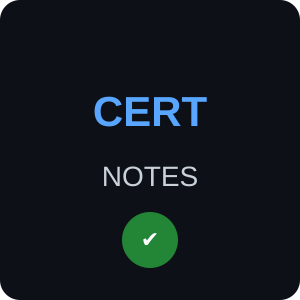

# Certification Notes

<p align="center">
  
</p>

<h1 align="center">Certification Notes</h1>

<p align="center">
  
  
</p>

<p align="center">
  
  
  
  
  
  
  
  
  
</p>

---

## About

Certification Notes is a structured knowledge portfolio for my professional IT certification preparation.

The repository documents learning progress, practical work, technical capabilities, and exam preparation across the following areas:

- Linux and system administration
- Networking
- Cloud computing
- Infrastructure as Code
- Kubernetes
- Cybersecurity
- Artificial Intelligence
- Machine Learning

The repository is updated continuously as I progress through the certification path.

---

## Certification Roadmap

The certifications are numbered according to the planned learning path and progression. The numbering is intentional and does not represent alphabetical ordering.

| # | Certification | Focus | Status |
|---:|---|---|---|
| 01 | Linux Essentials | Linux and System Administration | 🟡 In Progress |
| 02 | CCNA | Networking | ⚪ Planned |
| 03 | AWS Cloud Practitioner | Cloud Fundamentals | ⚪ Planned |
| 04 | AWS Solutions Architect – Associate | Cloud Architecture | ⚪ Planned |
| 05 | Terraform Associate | Infrastructure as Code | ⚪ Planned |
| 06 | Certified Kubernetes Administrator | Kubernetes Administration | ⚪ Planned |
| 07 | CompTIA Security+ | Cybersecurity | ⚪ Planned |
| 08 | AWS Certified AI Practitioner | Artificial Intelligence | ⚪ Planned |
| 09 | Machine Learning Engineer | Machine Learning | ⚪ Planned |

---

## Repository Structure

The repository uses a consistent structure for the certification path.

```text
Certification-Notes/
│
├── README.md
├── notes.md
│
├── _datasets/
│   ├── logo.svg
│   └── ...
│
├── 00-Linux-Cybersecurity-Essentials/
│   │
│   ├── README.md
│   ├── Cybersecurity-Learning-Units.md
│   ├── Linux-Learning-Units.md
│   ├── Cybersecurity-MAPPING.md
│   ├── Linux-MAPPING.md
│   └── ...
│
│
├── 01-Linux-Admin/
│
├── 02-Networking/
│
├── 03-Programming-and-Automation/
│
├── 04-AWS-Cloud/
│
├── 05-DevOps/
│
├── 06-Cloud-Security/
│
└── 07-AI-Cloud-Engineering/
```

The numbered certification directories define the planned certification sequence.

The `_datasets` directory contains repository-level files used to support the documentation, such as logos, diagrams, images, and other required data files.

Individual certification directories may grow additional technical subdirectories as required by the practical work of that certification.

---

## Learning Notes

The `notes.md` file represents the current state of learning, focusing on relevant knowledge and practical work for each stage of preparation.

A learning entry can contain:

* **Key Learning** — important concepts, technologies, and principles
* **Practical Work** — hands-on tasks, labs, commands, configurations, and troubleshooting
* **Capability Gain** — technical capabilities developed through the learning activity
* **Core Insight** — the central technical takeaway from the learning unit
* **Status** — current state of the learning item

---

## Learning Progress

The learning process follows a structured learning plan based on:

```text
Day → Learning Unit → Topic
```

`Day` identifies the learning day.

`Learning Unit (LU)` identifies the learning unit covered within that day.

For example:

```text
Day 03 / LU 1
Topic: Command Structure
```

The learning plan defines what is studied. The corresponding certification `notes.md` records the current state, relevant results, and acquired capabilities.

The chronological development of the repository is preserved through Git history.

---

## Practical Work

The amount and type of practical work depends on the requirements of the individual certification.

Depending on the certification, practical work may include:

* Linux command-line exercises
* Shell scripting
* Network configuration and troubleshooting
* Cloud configuration
* Infrastructure as Code
* Kubernetes administration
* Security exercises
* Architecture and network diagrams
* Technical troubleshooting
* Automation

Practical work is documented where it contributes to understanding or demonstrating the relevant technical capability.

---

## Learning Philosophy

> Learn → Practice → Understand → Verify → Document

The objective is not limited to passing certification exams.

The learning process is intended to develop practical and transferable technical capabilities and to document how theoretical knowledge is applied to technical tasks.

---

## Progress Model

Each certification follows a simple progress model:

```text
Planned
   ↓
In Progress
   ↓
Review
   ↓
Completed
```

The status reflects the current state of the corresponding certification or learning objective.

Detailed chronological changes are preserved through Git history, while the `notes.md` file provides the current learning state.

---

## Focus Areas

```text
Linux
Networking
Cloud
Infrastructure as Code
Kubernetes
Security
Artificial Intelligence
Machine Learning
```

---

## Status Legend

* 🟢 **Completed** — Certification or learning objective completed
* 🟡 **In Progress** — Currently being studied
* 🔵 **Review** — Knowledge is being revisited or consolidated
* ⚪ **Planned** — Part of the planned certification path

---

## Purpose

This repository serves two purposes:

1. **Learning documentation** — maintaining a structured record of the current knowledge and practical capabilities developed during certification preparation.
2. **Technical portfolio** — providing a public, organized representation of the technologies, concepts, practical work, and certification path covered during the learning process.
